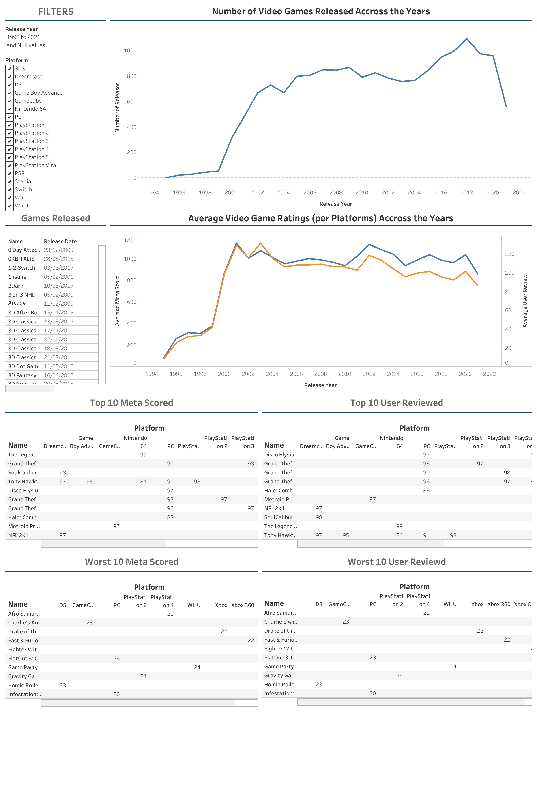

# SQL Analysis on Video Game Ratings

For this Exploratory Data Analysis, we are given the following Data from Kaggle:
* [Video Game Ratings and Reviews Dataset](https://www.kaggle.com/datasets/thedevastator/video-game-ratings-and-reviews-dataset): exported to all_games.csv file

In this dataset, we have the following data:
1. An index number assigned to each game.
2. The name of each game.
3. The platform each game is released on.
4. Meta score: An aggregated score given by professional critics on a scale from 0 to 100.
5. User review: Feedback provided by players/users who've played these games.

## Steps carried out
The steps carried out to get insights on the data retrieved were as follows:
1. Define the questions to be answered.
2. Clean the data.
3. Analyzed the data, based on questions in step 1.
4. Interpret and share the results. Data visualization to be done here.

## Insights to be retrieved
Below are the questions to be answered:
Here are some SQL analysis ideas based on the dataset columns:
* 		Overall Statistics:
    * Count the total number of games in the dataset.
    * Calculate average meta_score and user_review ratings.
    * Find the maximum and minimum ratings for both meta_score and user_review.
* 		Platform-wise Analysis:
    * Count the number of games available on each gaming platform.
    * Determine average ratings (meta_score and user_review) for each platform.
    * Identify platforms with the highest and lowest average ratings.
* 		Release Date Analysis:
    * Group games by release year or month to observe trends in the number of releases over time.
    * Analyze average ratings over different release years or months to see if there's any correlation between release date and ratings.
* 		Top-rated Games:
    * Retrieve the top-rated games based on meta_score and user_review.
    * Find games with the highest meta_score but lower user_review (or vice versa) to identify discrepancies between critic and user opinions.
* 		Correlation Analysis:
    * Check for any correlation between meta_score and user_review using SQL functions like CORR() or by calculating covariance.
    * Explore if the meta_score tends to align with user_reviews or if there's a significant difference.
* 		Summary Analysis:
    * Analyze the relationship between summary length and ratings.

## Cleaning of Data
A database named videogames was created in PostgreSQL Explorer and this database has been backed up to **videogames.sql**.

All cleaning and table creation was carried out in **create_tables.pgsql**.

The cleaning done was as follows:
- Updating the all_games table to have user_reviews as floats and removing instances of 'tbd' from user reviews.
- Also converting the release date from text to date format.

NB// the cleanup was done to the a table created for the all_games dataset. Sub-tables were also created separating the dataset by the platform (console), making a games table the table containing the PK.

## Analysis
All analysis to answer the above questions was carried out in **Analysis.pgsql**.
The results along wth the tables created was exported to numerous csv files in **"created data"** folder.
This was done with a shell script **data.sh**.

## Results and Visualizations
The created data from the analysis was used to create an interactive dashboard on Tableau Public:
[Video Games Over the Years](https://public.tableau.com/app/profile/melvin.quashie/viz/VideoGamesOvertheYears/Dashboard1)

The dashboard can be filtered by year and platform to show the following:
1. Number of games released
2. Names of games released
3. Average Video game ratings (both meta and user) across the years.
4. Top 10 and worst 10 meta scored games for the period/ platform
5. Top 10 and worst 10 user reviewed games for the period/ platform

Below is a snapshot of the dashboard:

